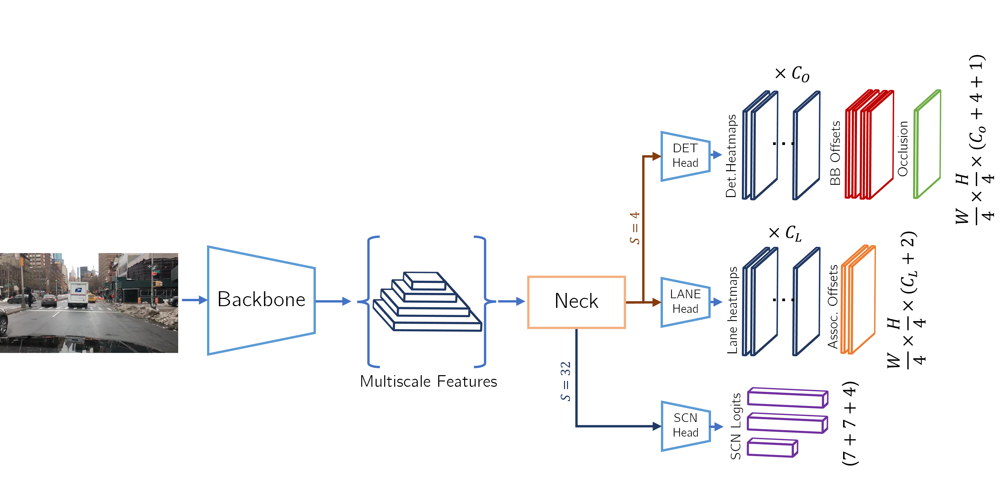

# CERBERUS: CEnterR Based Ent-to-end peRception Using a Single model [[arXiv]](https://arxiv.org/abs/2210.00756)

This is the official code repository for **"CERBERUS: Simple and Effective All-In-One Automotive Perception
Model with Multi Task Learning"**

## Model

<p align="center">
 
</p>

CERBERUS is a Deep-Learning based model for automotive perception with a Multi-task learning approach.
It simultaneously perform object detection (with classification of the occlusion state), lane estimation and scene classification.
This model is trained on BDD100k and perform well on real world driving footage, moreover we provide code for inference on Nvidia Jetson boards using the TensorRT framework.

## Demo
[](https://www.youtube.com/watch?v=npSDJ8seJ7E)
<br>
**(Video, click image to reproduce)**

## Requirements

This codebase is built using PyTorch and PyTorch-Lightning,
together with several other libraries. To replicate our experimental
setup we highly recommend to create and Ananconda environment, if you don't have
Anaconda installed yet you can [install it](https://docs.anaconda.com/anaconda/install/).

* Clone this repository
```
git clone git@github.com:cscribano/CERBERUS.git
cd CERBERUS
```
* Create a new Aanaconda environment
```
conda create -n cerberus python=3.8
```
* Install requirements
```
conda activate cerberus
conda install pytorch==1.8.1 torchvision==0.9.1 cudatoolkit=11.1 -c pytorch -c conda-forge -y
pip install -r requirements.txt
```

To perform inference using TensorRT the framework must be installed following the NVidia [documentation](https://docs.nvidia.com/deeplearning/tensorrt/install-guide/index.html).
 We officially supportonly TensorRT version 8.4.0.

## Inference

We provide a set of pretrained models above (`Model Zoo`) both as pytorch checkpoints and exported to onnx (for inference
using TensorRT).

### Inference using PyTorch
* Download the configuration file and the corresponding `.pth` checkpoint.
* The sample inference script perform inference on a video file, as an example you can find the public footage used for our demo [here](https://drive.google.com/file/d/1zS3L01VHwtPS9WrmOUD5G2V_A4rK7fB-/view?usp=sharing) ([credit](https://www.youtube.com/watch?v=zEl-EUIJTOU))
* Perform inference:
```
cd CERBERUS
python inference/run.py -c <path_to_config>.json -w <path_to_checkpoint>.pth -v <path_to_video>.mp4
```

* In addition you can add the option `-o true` to perform conversion to `.onnx`

### Interence using TensorRT
The sample inference code is similar to the PyTorch version, but it requires as input the `.onnx` model and the video file.
When a model is loaded for the first time it is converted to tensorrt, this process usually takes a very long time.

```
cd CERBERUS
python inference/run_tensorrt.py -m <path_to_model>.onnx -v <path_to_video>.mp4
```

### Running on NVidia Jetson
We provide a script to automatically install all the requirements on an Nvidia board, it is only tested on Jetson AGX Xavier
and Jetson Nano on a fresh install of JetPack 4.6.1

```
git clone git@github.com:cscribano/CERBERUS.git
cd CERBERUS/docs
chmod +x deps.sh
./deps.sh
```

The installation process require a very long time, at the end reboot is required. When done inference can be performed using TensorRT as described above.

### Model Zoo
| **Model**            |       **configuration**       |         **weights**          |             **onnx**              |
|:--------------------:|:-----------------------------:|:----------------------------:|:---------------------------------:|
| **resnet34_simple**      |   [resnet34_simple.json](https://drive.google.com/file/d/1uZqNuCwI3OHAUNG450XZQD2pQT7YIpDr/view?usp=sharing)    |   [resnet34_simple.pth](https://drive.google.com/file/d/1v5pa3LdXgjjsAiMxMgitBiy6brObskht/view?usp=sharing)    |   [resnet34_simple_sim.onnx](https://drive.google.com/file/d/1MOBMinfU0PrT8hPjjc7gXG4HOHYGCP7K/view?usp=sharing)    |
| **resnet34_bifpn**       |    [resnet34_bifpn.json](https://drive.google.com/file/d/1Ixuj72Rj2zFasyB-mu7rQiNuA6Yv2ZGg/view?usp=sharing)    |    [resnet34_bifpn.pth](https://drive.google.com/file/d/16jXHf1kEhR3QaXkJxijDxKbGwhNkbUEe/view?usp=sharing)    |    [resnet34_bifpn_sim.onnx](https://drive.google.com/file/d/18xoh22M0wR5O5yu4mDyKcytQaqxhN4hP/view?usp=sharing)    |
| **resnet50_bifpn**       |    [resnet50_bifpn.json](https://drive.google.com/file/d/1eXv7JJGFqHXy3Am0G-xu2ulKm4iRmEz5/view?usp=sharing)    |    [resnet50_bifpn.pth](https://drive.google.com/file/d/1Sm33JXcWo9a0uiOoqv02yKss1SkEUOWT/view?usp=sharing)    |    [resnet50_bifpn_sim.onnx](https://drive.google.com/file/d/1ER6weOsLPgX-GdS53ikr0oI-al2g7Yv8/view?usp=sharing)    |
| **resnet101_bifpn**      |   [resnet101_bifpn.json](https://drive.google.com/file/d/1-5aEQMul1j-Wr8jrOB2CH8yhYysuuXe5/view?usp=sharing)    |   [resnet101_bifpn.pth](https://drive.google.com/file/d/1Fc2yXc04CB1vsZnZSy1WT6rxjOJPMLjc/view?usp=sharing)    |   [resnet101_bifpn_sim.onnx](https://drive.google.com/file/d/1hCdz6o0PvNf5IF0-27tVPrh9OJKLD0W7/view?usp=sharing)    |
| **efficientnetb2_bifpn** | [efficientnetb2_bifpn.json](https://drive.google.com/file/d/1_F6JBX5i6wxV_MmcyaWnt95dOg3WlYUo/view?usp=sharing) | [efficientnetb2_bifpn.pth](https://drive.google.com/file/d/16wJCSj7bSAt_iPdPytWtH6TOtL8_LQ0x/view?usp=sharing) | [efficientnetb2_bifpn_sim.onnx](https://drive.google.com/file/d/1AkLHe8-KtsZ6sD-qLYl4DLlhYqaT_gdA/view?usp=sharing) |
| **mobilenetv2_bifpn**    |  [mobilenetv2_bifpn.json](https://drive.google.com/file/d/1ikR9ia9k9zVMznfuRbGryecfrVfB_GXU/view?usp=sharing)   |  [mobilenetv2_bifpn.pth](https://drive.google.com/file/d/1WZ3vPPSAF23yGpMIA4DINaBE-6-v2ZH9/view?usp=sharing)   |  [mobilenetv2_bifpn_sim.onnx](https://drive.google.com/file/d/1YUYp-QqSzvJDJj5bbdrA4crZBn_xMpvf/view?usp=sharing)   |


## Training

### Dataset
Only BDD100K is supported, the dataset is available for free from the autors (https://bdd-data.berkeley.edu/).
After downloading the dataset a pre-processing step is required to encode the lane makins annotations in the format required by Cerberus,
we provide the script `data/bdd100k_lane_keypoints.py` to take care of this step.

```
cd CERBERUS/data
python bdd100k_lane_keypoints.py -i <BDD100k_root>/bdd100k_images/images/100k -l <BDD100k_root>/bdd100k_lanes/labels/lane
```

The files `train_25_new.pt` and `val_25_new.pt` will be saved in the `/data` directory. If you have any problem in this step we provide the preprocessed labels [here](https://drive.google.com/file/d/1Cz7GByXW57IiVzHNY5SyDW3LuRt_GuMp/view?usp=sharing)

### Start training
* Adjust the configuration `.json` file in `./conf/experiments` accordingly to the directories where you extracted the dataset and the processet lane labels.
* Run the training loop:
```
python main.py --exp_name=<name_of_conf_file>
```

Please notice that the `.json` extension is NOT part of the experiment name: 
```i.e, conf file is "experiments/resnet34_bifpn.json" --> --exp_name=resnet34_bifpn```


## References
Presented at [PNARUDE](https://iros2022-pnarude.github.io/) Workshop @ IROS 

If you use CERBERUS in your research, please cite the following paper.
```
@article{scribano2022cerberus,
  title={CERBERUS: Simple and Effective All-In-One Automotive Perception Model with Multi Task Learning},
  author={Scribano, Carmelo and Franchini, Giorgia and Olmedo, Ignacio Sanudo and Bertogna, Marko},
  journal={arXiv preprint arXiv:2210.00756},
  year={2022}
}
```

For use in commercial solutions, write at carmelo.scribano@unimore.it or refer to https://hipert.unimore.it/ .
